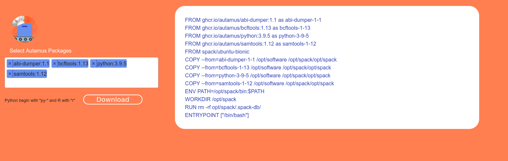

# Chef wasm

Chef wasm uses [https://github.com/autamus/chef](https://github.com/autamus/chef) in order to generate a web
interface to create a Dockerfile. Chef Autamus at your service!


This is an ideal approach if you want to use spack packages but you don't want to wait for them
to build (which can take forever!). Autamus containers can dump them easily into a spack install.
Note that since we are combining multiple containers, there may be issues that arise! This
is early in development and experimental. Please [open an issue](https://github.com/autamus/chef-wasm) if you have any trouble.

## Usage

### 1. Interface

Browse to the interface at [https://autamus.io/chef-wasm/](https://autamus.io/chef-wasm/) and then select the software packages (and versions)
that you want to install! Since this is spack, you are totally allowed to install
different versions of things.



Once you have your Dockerfile, click the "Download" button to save it! 

### 2. Build

On your local machine, you can build! It's recommended to use DOCKER_BUILDKIT for faster
builds.

```bash
export DOCKER_BUILDKIT=1
$ docker build -t chef-stack .
```

You might want to save the Dockerfile to version control if desired, or build
with a CI recipe. This might be desired if you eventually want to pull down
to a Singularity or Podman container on an HPC resource. 
Please [open an issue](https://github.com/autamus/chef-wasm) if 
you would like a CI example added to this repository.

### 3. Interact

When you shell into your container, you will be in the spack root.

```bash
$ docker run -it chef-stack
# /opt/spack
```

And spack is available to you!

```bash
# which spack
/opt/spack/bin/spack
```

To see your installed software, use `spack find`

```bash
$ spack find
root@62b0820b3524:/opt/spack# spack find
==> 61 installed packages
-- linux-ubuntu18.04-skylake / gcc@7.5.0 ------------------------
abi-dumper@1.1       gdbm@1.19       ncurses@6.2             vtable-dumper@1.2
berkeley-db@18.1.40  gettext@0.21    perl@5.32.1             xz@5.2.5
binutils@2.36.1      libelf@0.8.13   readline@8.1            zlib@1.2.11
bzip2@1.0.8          libiconv@1.16   tar@1.34
elfutils@0.182       libxml2@2.9.10  universal-ctags@master

-- linux-ubuntu18.04-x86_64 / gcc@7.5.0 -------------------------
bcftools@1.13        libmd@1.0.3          py-python-dateutil@2.8.1
berkeley-db@18.1.40  libpng@1.6.37        py-setuptools@50.3.2
bzip2@1.0.8          libunistring@0.9.10  py-six@1.15.0
curl@7.76.1          libxml2@2.9.10       python@3.9.5
expat@2.3.0          ncurses@6.2          python@3.9.6
freetype@2.10.4      openblas@0.3.15      qhull@2020.1
gdbm@1.19            openssl@1.1.1k       readline@8.1
gettext@0.21         patchelf@0.12        samtools@1.12
htslib@1.12          perl@5.35.0          sqlite@3.35.5
htslib@1.13          py-cycler@0.10.0     tar@1.34
libbsd@0.11.3        py-kiwisolver@1.1.0  util-linux-uuid@2.36.2
libffi@3.3           py-matplotlib@3.4.2  xz@5.2.5
libiconv@1.16        py-numpy@1.21.0      zlib@1.2.11
libidn2@2.3.0        py-pillow@8.0.0
libjpeg-turbo@2.0.6  py-pyparsing@2.4.7
```

And then to load any particular piece of software (meaning it gets added to your path):

```bash
# setup your environment
$ . /opt/spack/share/spack/setup-env.sh

# load Python
root@62b0820b3524:/opt/spack# spack load python@3.9.5

# Did we loadi it?
root@62b0820b3524:/opt/spack# which python
/opt/spack/opt/spack/linux-ubuntu18.04-x86_64/gcc-7.5.0/python-3.9.5-kykqwyent2svlspsvehqpu4xdgcp54z5/bin/python

/opt/spack# python --version
Python 3.9.5
```

That's it!


## Development

You'll first need to generate a chef.wasm file under [docs](docs).

```bash
$ make
```

You can then deploy this on GitHub pages, or run a local webserver.

```bash
$ cd docs
$ python -m http.server 9999
```
